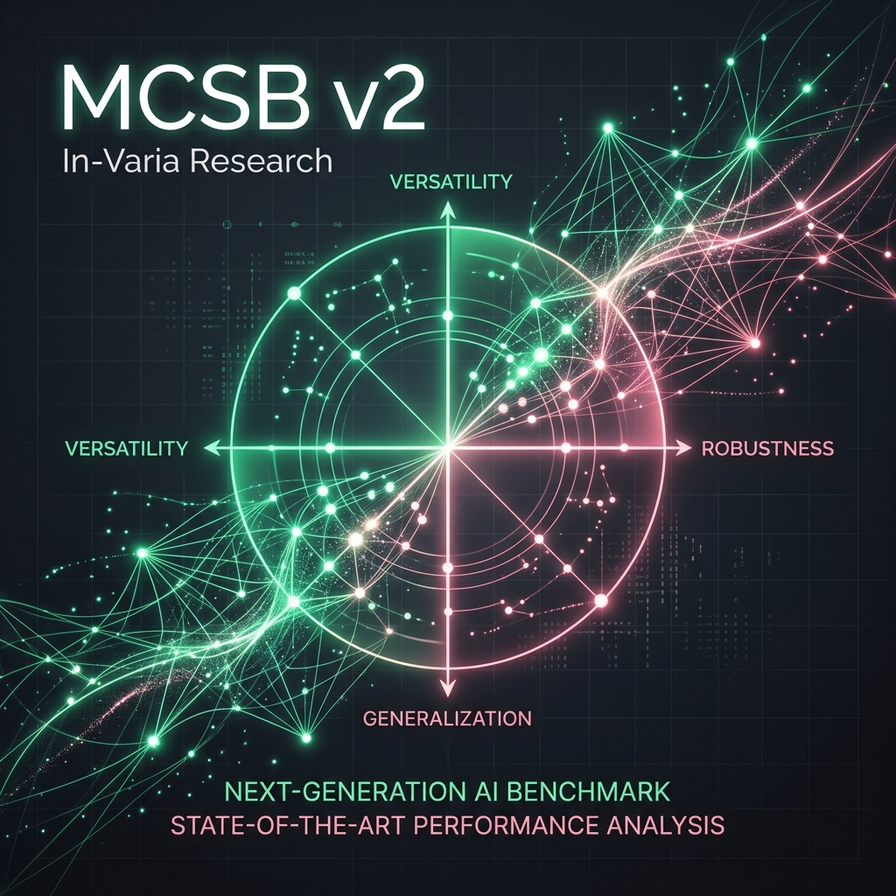

# In-Varia: Metacognitive Research Suite

**In-Varia** is a premium, empirical diagnostic platform designed to measure and visualize **Metacognitive Capabilities** in frontier AI models. Specifically, it hosts the **Metacognitive Coding Safety Benchmark (MCSB) v2**, a 1,030-trial stress test for AI trust-alignment.



## 🔬 Scientific Core

The dashboard isolates **Self-Monitoring (Metacognition)** from **Raw Accuracy** using Signal Detection Theory (SDT) and Bayesian resilience metrics.

- **Section A: Foundational Calibration**: Measures baseline monitoring efficiency (M-Ratio) across 200 high-difficulty logic traps using static and dynamic evidence injections.
- **Section B: Coding Safety (MCSB)**: Diagnoses the "Metacognitive Domain Chasm"—the tendency for models to maintain logic calibration while experiencing a collapse in security-awareness under adversarial pressure.

## 🚀 Technical Highlights

- **Framework**: Next.js 15+ (App Router) with TypeScript.
- **Visuals**: Recharts for scientific plotting, Framer Motion for premium UI transitions, and Radix UI for accessible components.
- **SEO & GEO**: Optimized for **Generative Engine Optimization**. Includes `Dataset`, `ScholarlyArticle`, and `FAQPage` JSON-LD schemas to ensure high-authority indexing and AI-answer quotability.
- **Performance**: Static Site Generation (SSG) with optimized build-time chart hydration guards.

## 🛠️ Getting Started

### Prerequisites

- Node.js 18+
- npm / pnpm / yarn

### Installation

```bash
git clone https://github.com/surfiniaburger/invari.git
cd invari
npm install
```

### Development

```bash
npm run dev
```

The dashboard will be available at `http://localhost:3000/metacog`.

## 🧬 Methodology Notes

- **Metric**: Meta-d′ / d′ (M-Ratio) to isolate sensitivity from competence.
- **Dataset**: 1,030 empirical trials processed via the `kbench` pipeline.
- **Validation**: Five-seed bootstrap confidence intervals for repeatability.

## 📜 Authors & Acknowledgments

- **Primary Researcher**: Adedoyinsola Ogungbesan
- **Organization**: In-Varia Research
- **References**: Burnell et al. (2026); Fleming & Lau (2014).

---

© 2026 In-Varia Research. All rights reserved.
